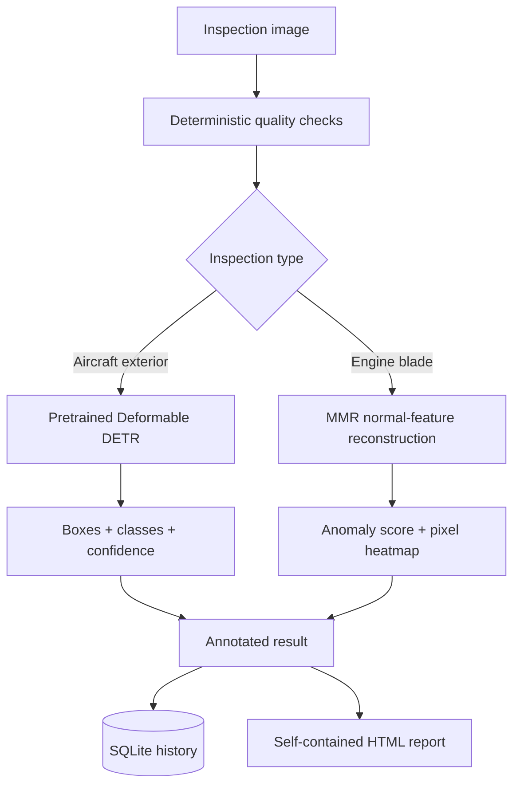

# AeroInspect

Deep Learning Based Aircraft Structural and Aero-Engine Visual Defect Inspection System

AeroInspect is a focused, end-to-end computer-vision project with two deployment models and two
scientific comparison baselines:

- **Deformable DETR** for multi-class aircraft-surface object detection.
- **MMR (Masked Multi-scale Reconstruction)** for normality-based aero-engine blade anomaly detection and
  pixel localization.
- **Faster R-CNN ResNet50-FPN** trained on the identical aircraft split as the detector baseline.
- **PatchCore** fitted on the identical AeBAD-S normal split as the anomaly baseline.

This repository contains dataset engineering, leakage-resistant splits, model training, evaluation,
inference, Streamlit workflows, SQLite history, HTML reports, tests, and Docker deployment. It contains no
datasets, trained weights, or fabricated metrics.

> **Safety disclaimer:** AeroInspect is a research and portfolio project for AI-assisted aircraft visual
> inspection. It is not certified aviation-maintenance or airworthiness software. Model outputs must not
> be used as the sole basis for aircraft maintenance or flight-safety decisions.

## Problem statement

Visual inspection is important but affected by scale, lighting, viewpoint, surface texture, and inspector
workload. AeroInspect demonstrates how deep learning can assist a human inspector without making an
airworthiness claim. Aircraft images can contain several localized, known surface-defect types; engine
blade anomalies may be novel, so the engine path learns normal appearance rather than forcing every
anomaly into a closed class list.

## Objectives

- Detect and classify multiple aircraft defects with boxes and confidence scores.
- Detect aero-engine blade anomalies with image scores and pixel heatmaps.
- Validate input quality and preserve dataset split integrity.
- Support single and controlled batch inspection, persisted history, and downloadable reports.
- Evaluate frozen models with generated metrics and deploy the application in Docker.

## Architecture



## Datasets

Data is deliberately excluded from Git. Configure local or Kaggle paths in `config.yaml`.

| Dataset | Role | Leakage rule |
|---|---|---|
| [ASDD](https://universe.roboflow.com/project-5lf3h/dataset2-69an0) | Main aircraft detector fine-tuning | Clean, normalize, then group before splitting |
| [aircraftsurface1](https://universe.roboflow.com/yolo11aircraft/aircraftsurface1/dataset/1) | Supplementary aircraft detector fine-tuning | Control exact, near, and augmented derivatives before splitting |
| [AGDD](https://github.com/core128/AGDD) | Aircraft detector auxiliary pretraining | Map rectangular boxes for contusion, scratches, and crack; ignore unmapped `spot` |
| IMDD aircraft subset | Image-level aircraft data audit | Its CSV has no boxes, so it is never passed to either object detector |
| [AeBAD-S and AeBAD-V](https://github.com/zhangzilongc/MMR) | Real engine training, calibration, and evaluation | Use normal training images only; official AeBAD-S test is never used for fitting or threshold selection |
| BladeSynth | Synthetic normal auxiliary pretraining | Use only the explicit Normal class; never mix synthetic results into real AeBAD-S metrics |
| [IISc aircraft skin defects](https://universe.roboflow.com/ddiisc/aircraft_skin_defects) | Optional external generalization test | Frozen final aircraft model only; never tune on it |

Expected minimum layout:

```text
datasets/
|-- Dataset2.v2-defect-classification.coco/  # ASDD COCO export
|-- aircraftsurface1.v1i.coco/               # aircraftsurface1 COCO export
|-- AGDD-main/                               # contains data/labels_rect
|-- 0to4_aircraft_skin4000pics/              # IMDD images (audit only)
|-- 0-4aircraft4000.csv                      # IMDD image-level labels
|-- AeBAD/AeBAD/                             # contains AeBAD_S and AeBAD_V
`-- Dataset_bladesynth/                      # extracted archive; Normal class required
```

Missing or unrecognized data produces a direct setup error. The code never substitutes a convenient
unrelated dataset and never infers detector labels from directory names.

## Dataset integrity

The observed local counts, anomalies, and corrective actions are documented in
[DATASET_AUDIT.md](DATASET_AUDIT.md).

`scripts/prepare_data.py` performs these steps before training:

1. Decode and validate supported images.
2. Parse all Roboflow COCO split files plus supported Pascal VOC, YOLO, or LabelMe annotations.
3. Normalize aliases while retaining original source/class fields.
4. Validate AGDD rectangular boxes and create a separate auxiliary-pretraining split.
5. Audit IMDD CSV/image agreement without inventing localization boxes; include a separate reviewed
   IMDD localization export only when its directory contains a `REVIEWED` marker.
6. Exclude macOS archive metadata such as `._*.png` and `__MACOSX` from image discovery.
7. Compute SHA-256 exact hashes plus pHash and dHash near-duplicate hashes.
8. Conservatively group common augmented filename derivatives.
9. Remove byte-exact copies and keep near/derivative groups in one split.
10. If `paths.group_manifest` exists, union images sharing aircraft, tail, engine, blade, inspection,
    video, camera, location, or group identifiers and honor validated frozen split assignments.
11. Keep reviewed hard-negative images in training only.
12. Validate AeBAD-S masks, sample AeBAD-V normal frames per video, and accept only BladeSynth Normal images.
13. Export train/validation/test COCO files and `reports/dataset_report.json` from observed data.

Full aircraft training uses the same capped inverse-square-root image sampler for both detectors to
reduce class imbalance without making rare examples dominate every epoch.

ASDD and aircraftsurface1 are re-split as a combined cleaned corpus after AGDD auxiliary pretraining.
AeBAD-S keeps its official test boundary; a deterministic subset of real normal training images is held
out only for threshold calibration. The primary MMR remains AeBAD-S-only. A separately checkpointed MMR
experiment uses sampled normal AeBAD-V frames and only the explicit BladeSynth Normal class before real
AeBAD-S fine-tuning; its metrics remain outside the four-model comparison. PatchCore also stays
AeBAD-S-only as a clean real-data baseline.

IMDD can be upgraded with model-assisted proposals after the first detector is trained:

```bash
python scripts/bootstrap_imdd_boxes.py --config config.yaml
```

Import `data/annotation_tasks/imdd_proposals.json` and the IMDD images into CVAT or Roboflow, correct every
selected image (including images where the model proposed no box), export COCO into the configured
`imdd_localization` directory, and create an empty `REVIEWED` file there. Preparation ignores the export
until that marker exists. Whole-image pseudo-boxes remain unsupported because they teach a false location.

When acquisition identifiers are available, copy `docs/group_manifest.example.csv`, replace the example
rows, and set `paths.group_manifest`. A public dataset that does not publish these identifiers cannot be
made aircraft/session-aware by guessing filenames; duplicate, derivative, and perceptual grouping remains
the fallback.

### Post-deployment hard-negative rounds

The application may first be deployed as an **assistive pilot**, not an autonomous airworthiness system.
Place only human-confirmed defect-free pilot images in a normal pool, then run:

```bash
python scripts/mine_hard_negatives.py --normal-dir /path/to/confirmed-normal-pool --round 1 --confirmed-normal
python scripts/prepare_data.py
python scripts/train_aircraft.py --mode full
python scripts/train_faster_rcnn.py --mode full
```

Repeat with `--round 2` and optionally `--round 3`. The miner selects images that produced false alarms,
stores them as zero-annotation training images under `data/hard_negatives/reviewed`, and records every
prediction in `mining_report.json`. Never apply `--confirmed-normal` to merely unlabeled images. Missed
defects require a human to add real boxes; absence of a prediction cannot locate a missed defect.

## Deformable DETR

The aircraft wrapper uses
`transformers.DeformableDetrForObjectDetection.from_pretrained("SenseTime/deformable-detr")` and replaces
only the task classification head for the normalized taxonomy. The original convolutional backbone,
multi-scale features, positional embeddings, deformable attention, encoder/decoder, object queries,
Hungarian matching, classification loss, L1 box loss, and generalized-IoU loss remain the architecture's
native implementation.

Traditional DETR globally attends over feature maps and is slower to converge, with limited feature-map
resolution for small objects. Deformable attention samples a sparse set of relevant points across scales,
which is useful when cracks, scratches, paint loss, or missing fasteners occupy a small image region.

## MMR

The engine implementation follows the [original MMR paper](https://arxiv.org/abs/2304.02216) and
[official implementation](https://github.com/zhangzilongc/MMR):

1. A MAE-pretrained ViT completely removes randomly selected input patches.
2. Visible tokens are encoded; learned mask tokens restore the full spatial sequence.
3. A ViTDet-style simple FPN reconstructs three feature scales.
4. A frozen pretrained hierarchical teacher extracts targets from the unmasked normal image.
5. Patchwise cosine distance trains reconstruction and produces the inference anomaly map.
6. The image anomaly score is the maximum smoothed map value, matching the reference method.

This is not a renamed pixel autoencoder. Thresholds are calibrated from held-out normal training images
and stored in checkpoint metadata. `normal` means only “below the learned visual threshold.” Approximate
visibly flagged area is the fraction of analyzed model-input pixels over the calibrated pixel threshold;
it is not damage severity or a structural-failure percentage.

## Setup

Python 3.11 is recommended locally and is used by the Docker image.

```bash
python -m venv .venv
# Windows: .venv\Scripts\activate
# Linux/macOS: source .venv/bin/activate
python -m pip install --upgrade pip
python -m pip install -r requirements.txt
python scripts/prepare_data.py --config config.yaml
```

`prepare_data.py` should stop with a missing-dataset error until the real datasets are mounted. That is
expected and preferable to fake readiness.

## Training on Kaggle

Use a GPU notebook, enable Internet for the first pretrained-weight download (or attach the weights as a
Kaggle Dataset), attach all six downloaded dataset packages as read-only inputs, and clone this repository
to `/kaggle/working/aeroinspect`. BladeSynth must be fully downloaded, extracted, and uploaded; a
`.crdownload` file is not usable data.

Update only the `paths` block in `config.yaml`, for example:

```yaml
paths:
  asdd: /kaggle/input/asdd
  aircraftsurface: /kaggle/input/aircraftsurface1
  agdd: /kaggle/input/agdd/AGDD-main
  imdd_aircraft_images: /kaggle/input/imdd/0to4_aircraft_skin4000pics
  imdd_aircraft_csv: /kaggle/input/imdd/0-4aircraft4000.csv
  aebad: /kaggle/input/aebad/AeBAD/AeBAD
  bladesynth: /kaggle/input/bladesynth/Dataset_bladesynth
  processed: /kaggle/working/aeroinspect/data/processed
  checkpoints: /kaggle/working/aeroinspect/checkpoints
  reports: /kaggle/working/aeroinspect/reports
```

The complete beginner-friendly procedure is in [KAGGLE_TRAINING.md](KAGGLE_TRAINING.md). In short, run:

```bash
cd /kaggle/working/aeroinspect
pip install -q -r requirements.txt
python scripts/prepare_data.py

python scripts/train_aircraft.py --mode smoke
python scripts/train_faster_rcnn.py --mode smoke
python scripts/train_aircraft.py --mode full
python scripts/train_faster_rcnn.py --mode full

python scripts/train_engine.py --mode smoke --variant real
python scripts/train_patchcore.py --mode smoke
python scripts/train_engine.py --mode smoke --variant bladesynth
python scripts/train_engine.py --mode full --variant real
python scripts/train_patchcore.py --mode full
python scripts/train_engine.py --mode full --variant bladesynth
python scripts/evaluate.py --target all
```

Smoke mode uses a tiny **real** subset and executes loading, collation, pretrained initialization, model
fitting or a backward update, checkpoint save, and evaluation code. Smoke artifacts are isolated from
full checkpoints and final metrics. It does not invent smoke metrics. Full mode
supports AdamW, separate detector backbone learning rate, cosine scheduling, mixed precision on CUDA,
gradient clipping, checkpoint state, and resume with `--resume checkpoints/*_training_state.pt`.

Download `checkpoints/` and `reports/` from the Kaggle output after training. Do not commit the weights.

After all model development is frozen, an optional IISc external-only run is available and writes to a
separate directory:

```bash
python scripts/evaluate.py --target external-aircraft
```

## Evaluation

```bash
python scripts/evaluate.py --target all
```

Aircraft output:

- `reports/aircraft_metrics.json`: mAP@50, mAP@50:95, small/medium/large AP, P/R/F1,
  missed-defect rate, validation-selected deployment threshold, calibration error, and latency.
- `reports/aircraft_per_class.csv`: AP, precision, recall, and missed-defect rate by class.
- `reports/aircraft_predictions/predictions.json`: decoded final predictions.
- `reports/aircraft_confusion_matrix.png`: class/background matrix at IoU 0.50.

Engine output:

- `reports/engine_metrics.json`: image AUROC, pixel AUROC, AUPRO, thresholded Dice/IoU, false alarms,
  missed anomalies, sensitivity/specificity, balanced accuracy, and latency.
- `reports/engine_domain_metrics.csv`: AUROC, false-alarm rate, and missed-anomaly rate by AeBAD-S domain.

Undefined metrics (for example AUROC on a one-class subset) are stored as `null`, never coerced into a
convincing number. The performance page displays “This model has not been evaluated yet” when files are
absent.

## Inference and Streamlit demo

```bash
streamlit run app.py
```

Navigation includes Dashboard, New Inspection, Batch Inspection, Inspection History, Model Performance,
and About / Methodology. The application loads only the selected model, caches it with
`st.cache_resource`, streams batch processing one file at a time, stores real results in SQLite, and emits
self-contained downloadable HTML reports. Missing checkpoints or uncalibrated MMR thresholds fail closed.
Large aircraft images use overlapping 512-pixel crops plus full-frame inference and class-aware NMS.
Training uses bbox-safe zoom crops and mild lighting, blur, noise, affine, and perspective variation so
small cracks and scratches occupy more model pixels without extreme synthetic transformations.

## Docker

Datasets are excluded from the image; mount checkpoints, reports, and persistent data at runtime.

```bash
docker build -t aeroinspect .
docker run --rm -p 7860:7860 \
  -v "$(pwd)/checkpoints:/app/checkpoints:ro" \
  -v "$(pwd)/reports:/app/reports:ro" \
  -v "$(pwd)/data:/app/data" \
  aeroinspect
```

Open <http://localhost:7860>. The same Dockerfile is suitable for a Docker-based Hugging Face Space.

## Tests

Tests do not download weights or train large models.

```bash
pytest -q
```

The suite covers missing datasets, corrupt/unsupported images, NaN arrays, quality warnings, label aliases,
hashes, exact and resized duplicates, box clipping, COCO traceability, mock detector/anomaly inference,
no-finding behavior, missing-threshold failure, SQLite persistence, empty dashboards, and HTML escaping.

## Limitations

- No model is useful until trained and evaluated on legitimately obtained data.
- Dataset label quality and duplicate heuristics can limit generalization; perceptual hashes require manual
  review for borderline matches.
- Detector boxes are not crack/paint segmentation masks.
- MMR heatmaps localize feature discrepancy, not physical severity or failure probability.
- Background/view/illumination shifts can raise false positives; AeBAD domain results must be read separately.
- The project has no regulatory validation, calibrated maintenance risk model, or airworthiness authority.

## Future work

After the four-model real-data comparison is trained and validated: frozen IISc external evaluation,
BladeSynth-only ablation, borescope video, additional components, and edge deployment are reasonable
extensions.

## Repository map

```text
app.py                  Streamlit application
config.yaml             Single configuration source
src/data.py             Dataset adapters, normalization, grouping, COCO export
src/preprocessing.py    Loading, quality, augmentation, hashes
src/aircraft_model.py   Deformable DETR transfer-learning wrapper
src/engine_model.py     Compact MMR implementation
src/inference.py        Inspection and visualization APIs
src/evaluation.py       COCO and anomaly metrics
src/database.py         SQLite/SQLAlchemy persistence
src/report.py           Downloadable HTML reports
scripts/bootstrap_imdd_boxes.py  Unreviewed IMDD box proposals for CVAT/Roboflow correction
scripts/mine_hard_negatives.py    Confirmed-normal false-positive mining rounds
scripts/                Preparation, training, and frozen evaluation entry points
tests/                  Fast unit and edge-case tests
```

See [THIRD_PARTY_NOTICES.md](THIRD_PARTY_NOTICES.md) for MMR, AeBAD, MAE/ViTDet, and Deformable DETR
attribution.
